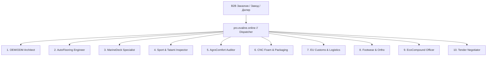

# pro.evaline.online — EvaLine Pro & Инженерный ИИ-Кластер

Портал [**pro.evaline.online**](https://pro.evaline.online) спроектирован как промышленно-инженерный центр экосистемы **EvaLine**, ориентированный на крупных B2B-заказчиков, OEM/ODM контракты, автомобильные заводы, спортивные федерации, судоверфи и агрохолдинги.

---

## Топ-10 Специализированных Профессий (LLM-Агентов) для EvaLine

Исходя из технологической базы компании (завод ЭВА-полимеров в Черноморске, логистический хаб в Братиславе, каталог плотностей 35–150 кг/м³, твердостей 20–75 Shore A, парка ЧПУ-раскроя и пресс-форм), разработана матрица из **10 автономных ИИ-агентов**:

### 1. EvaLine OEM/ODM Solutions Architect (Инженер-конструктор OEM/ODM)
* **Миссия**: Проектирование рецептур полимеров и технологических карт под ТЗ заказчика.
* **Специализация**:
  * Подбор соотношения этиленвинилацетата (VA content 18–28%) для требуемой эластичности и ударной вязкости.
  * Расчёт коэффициента термического расширения, усадки после формовки (допуски $\pm 1.5\%$).
  * Проектирование параметров пресс-форм: расчёт объёма заготовки и коэффициента вспенивания (expansion factor $1.4\times - 1.8\times$).
  * Формирование официального Technical Data Sheet (TDS) на 3 языках (EN, DE, UK).

### 2. AutoFlooring Matrix Engineer (Инженер автомобильных систем и лекал)
* **Миссия**: Автоматизированный подбор и проектирование автомобильных ковриков и обшивки.
* **Специализация**:
  * База геометрии кузовов 1200+ моделей легковых и грузовых авто (Европа, США, Азия).
  * Расчёт объёма удержания влаги и грязи: ячейка «Ромб» (глубина 8 мм) и «Сота» (глубина 7 мм) — до 2.5 л/м².
  * Подбор полимерного канта (окантовка лентой или полимерным шнуром) и установка штатных клипс/люверсов под оригинальные крепления пола.

### 3. MarineDeck Pro Specialist (Морской инженер палубных покрытий)
* **Миссия**: Палубные покрытия для катеров, яхт, гидроциклов и SUP-досок.
* **Специализация**:
  * Расчёт устойчивости к ультрафиолету (UV-resistance ISO 4892-2, 3000+ часов без выгорания).
  * Двухслойные гравированные листы (Dual Layer): верхний слой тиковый/серый (3 мм), нижний контрастный черный (3 мм) с фрезеровкой полос под тик на ЧПУ.
  * Подбор высокоадгезивного влагостойкого клеевого слоя (акриловые клеи типа 3M 9448A / VHB).

### 4. Sport & Tatami Safety Inspector (Эксперт спортивных покрытий и татами)
* **Миссия**: Сертификация и комплектация залов единоборств, фитнес-клубов и детских зон.
* **Специализация**:
  * Расчёт коэффициента критической высоты падения (HIC — Head Injury Criterion, стандарт EN 1177).
  * Оптимизация замкового соединения «ласточкин хвост» (dovetail puzzle lock): нулевой зазор, исключение смещения при динамических нагрузках борцов весом до 130 кг.
  * Реверсивные двухцветные маты (красно-синие, желто-синие) с текстурой «рисовая соломка» или «плетёнка».

### 5. Livestock & AgroComfort Auditor (Зооинженер и технолог агро-покрытий)
* **Миссия**: Покрытия для животноводческих комплексов, конюшен и молочных ферм.
* **Специализация**:
  * Термоизоляция от холодного бетонного пола: теплопроводность $\lambda = 0.034$ Вт/(м·К), снижающая заболеваемость скота маститом на 40%.
  * Упругость под копыта: твердость 60–65 Shore A для снижения нагрузки на суставы КРС и лошадей.
  * Химическая стойкость к аммиаку, навозной жиже и дезинфицирующим средствам с закрытопористой структурой (нулевое влагопоглощение $<0.1\%$).

### 6. Industrial Packaging & CNC Foam Designer (Инженер ложементов и защитной тары)
* **Миссия**: Прецизионные защитные вкладыши (ложементы) для чемоданов, кейсов, оптики и оружия.
* **Специализация**:
  * Анализ G-force кривых чувствительности электроники и оптики при падении с высоты 1–2 м.
  * Оптимизация 2D/3D Nesting-раскладки на ЧПУ фрезерных и лазерных станках для минимизации обрезков (отходы $< 8\%$).
  * Композитные ложементы: жесткий базовый EVA (твердость 55A) + мягкий бархатистый демпфер (твердость 25A).

### 7. EU Customs & Logistics Dispatcher (Таможенный брокер и логист хаба Братислава)
* **Миссия**: Международная логистика, таможенная очистка и расчет маршрутов по ЕС.
* **Специализация**:
  * Классификация по кодам ТН ВЭД / HS Codes: `3921.19.00` (плиты, листы, пленка и полосы из прочих пористых пластмасс).
  * Расчёт условий Incoterms 2020: DAP Братислава, DDP Варшава, FCA Черноморск.
  * Пакет документов: сертификат происхождения EUR.1 (беспошлинный ввоз в ЕС по соглашению об ассоциации), CMR, упаковочные листы.
  * Оптимизация вместимости фуры: 13.6-метровый полуприцеп вмещает до 1200 стандартных листов $1000 \times 2000 \times 10$ мм.

### 8. Footwear & OrthoComponent Technologist (Технолог обувных компонентов и ортопедии)
* **Миссия**: Производство подошв, межподошв (midsoles) и ортопедических стелек.
* **Специализация**:
  * Расчёт коэффициента остаточной деформации при сжатии (Compression Set, ISO 815 $< 35\%$).
  * Температурные режимы термоформовки и вакуумного формования стелек (рабочий диапазон $115^\circ\text{C} - 130^\circ\text{C}$).
  * Антимикробные добавки с ионами серебра ($Ag^+$) для диабетической и спортивной обуви.

### 9. EcoCompound & Circular Economy Officer (Технолог рециклинга и эко-компаундов)
* **Миссия**: Вторичная переработка, утилизация отходов и соответствие нормам ESG / Green Deal ЕС.
* **Специализация**:
  * Грануляция и рециклинг обрезков производства: ввод до 30–45% вторичной гранулы без ухудшения механической прочности на разрыв (ISO 1798).
  * Разработка Bio-EVA компаундов на основе этанола из сахарного тростника с углеродно-отрицательным следом.
  * Декларирование соответствия регламентам REACH (отсутствие фталатов, формамида $< 200$ ppm) и RoHS.

### 10. Tender & Commercial Contract Negotiator (B2B Тендерный аналитик и контракт-менеджер)
* **Миссия**: Подготовка коммерческих предложений, расчет ступенчатых скидок и тендерной документации.
* **Специализация**:
  * Многоуровневый прайсинг: розница / мелкий опт (от 10 листов) / дилер (от 100 листов) / заводской опт (от 1000 листов или контейнер).
  * Формирование графиков поэтапной оплаты (30% аванс / 70% по факту CMR) и аккредитивов.
  * Подготовка тендерных заявок для государственных и муниципальных закупок (школы, спорткомплексы, военные ведомства).

---

## Интеграция с EvaBrain & Consilium

Все 10 агентов подключаются к единой шине **OmniRoute** и используют:
1. **Базу знаний EvaLine FTS5**: мгновенный доступ к артикулам, сертификатам, протоколам испытаний.
2. **Мультимодельный консилиум**: перекрёстная верификация сложных расчётов (Claude 3.5 Sonnet для расчёта прочности, Gemini 2.5 Flash для скорости, DeepSeek R1 для глубоких технологических цепочек).
3. **Голосовой интерфейс (Edge-TTS)**: возможность голосовых консультаций для клиентов прямо на сайте `pro.evaline.online`.
